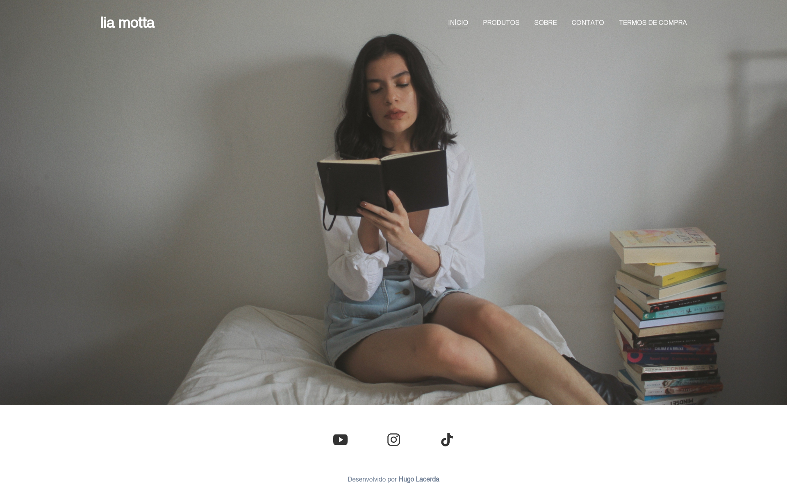
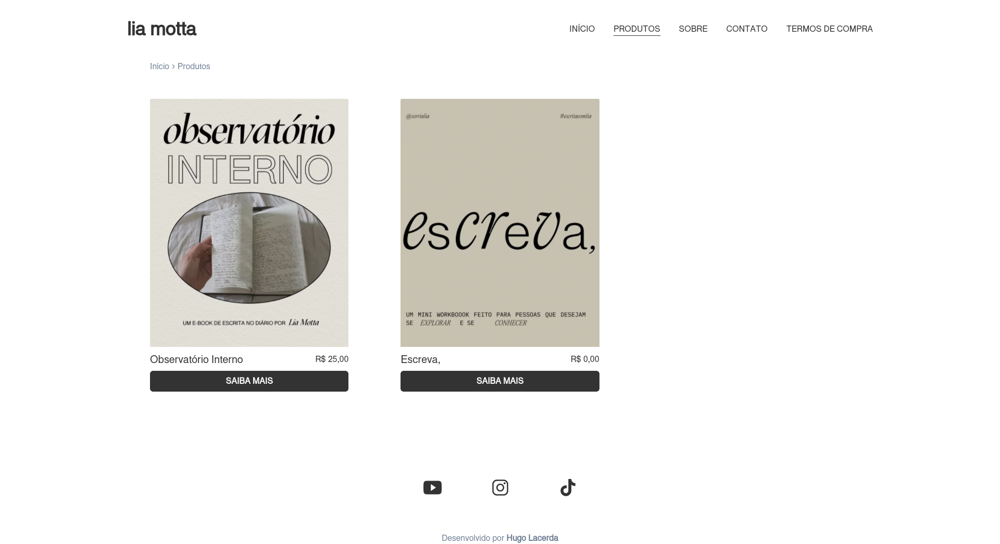
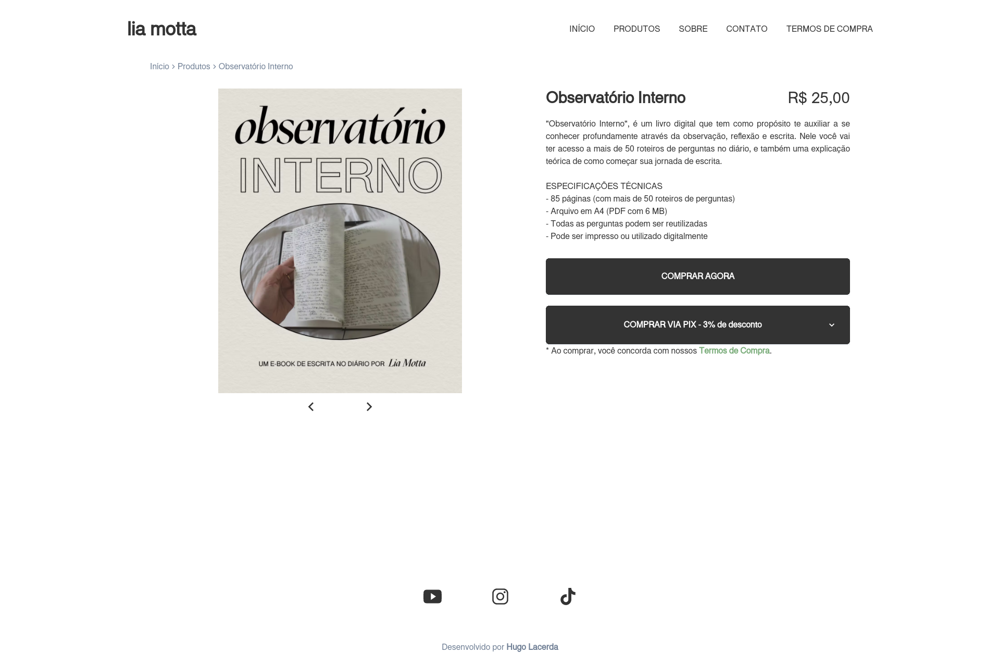
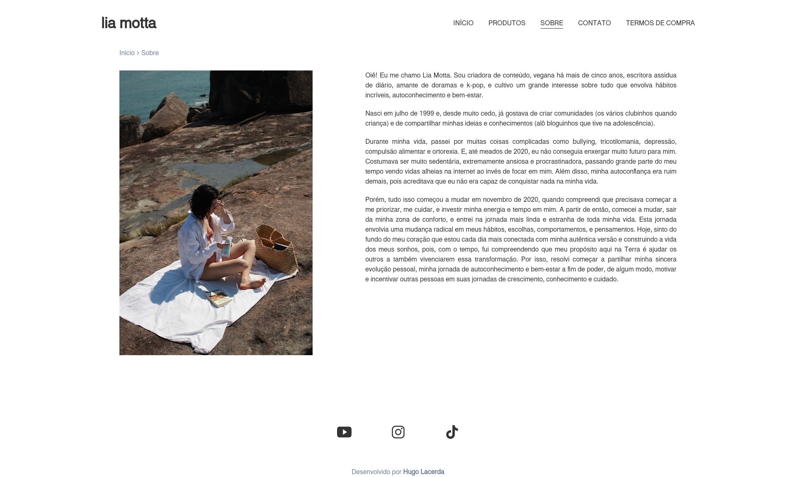
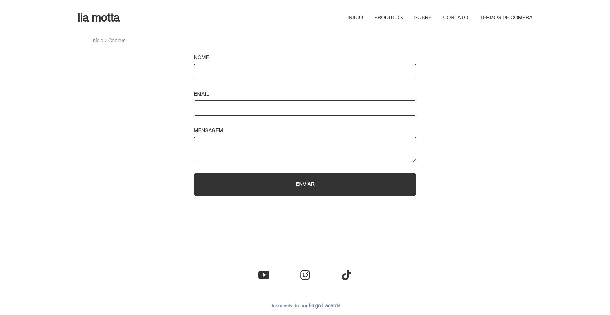
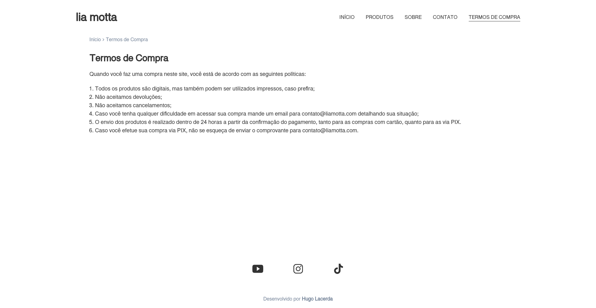
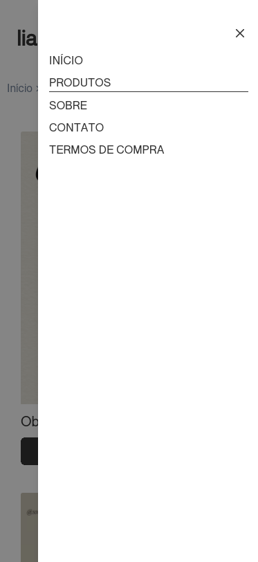

# 
# Lia Motta's personal brand website
<table>
<tr>
<td>
  A personal website I developed for the content creator Lia Motta. Through her website, it is possible to get to know more about her, to get in touch using the contact form, and to take a look and buy any of her digital products, as well as find her at all the social networks she creates for.
</td>
</tr>
</table>

## Live
The project is live at :  https://www.liamotta.com/

## Site

### Landing Page

### Products

### Detail

### About

### Contact

### Purchase Terms

## Responsive

## Built with 

- [Next.js](https://nextjs.org/)
- [Typescript](https://www.typescriptlang.org)
- [Chakra UI](https://chakra-ui.com) 
- [Prismic](https://prismic.io)
